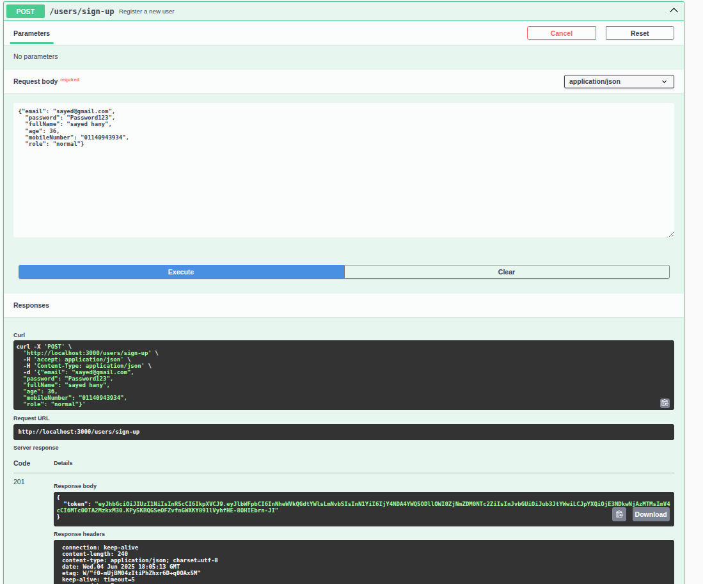
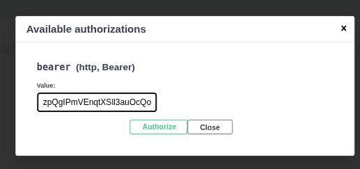
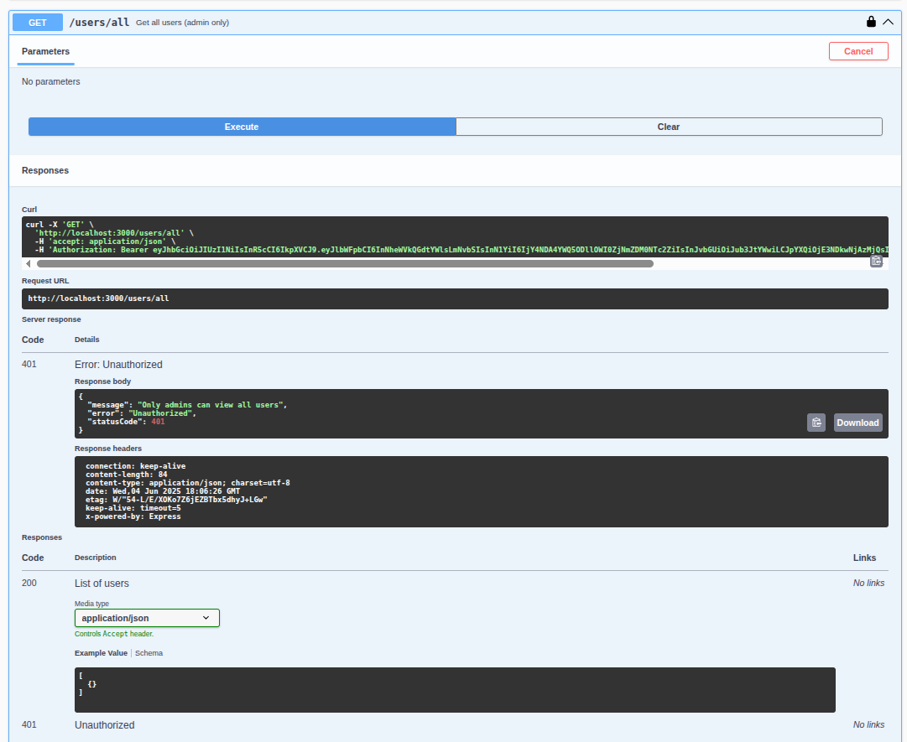
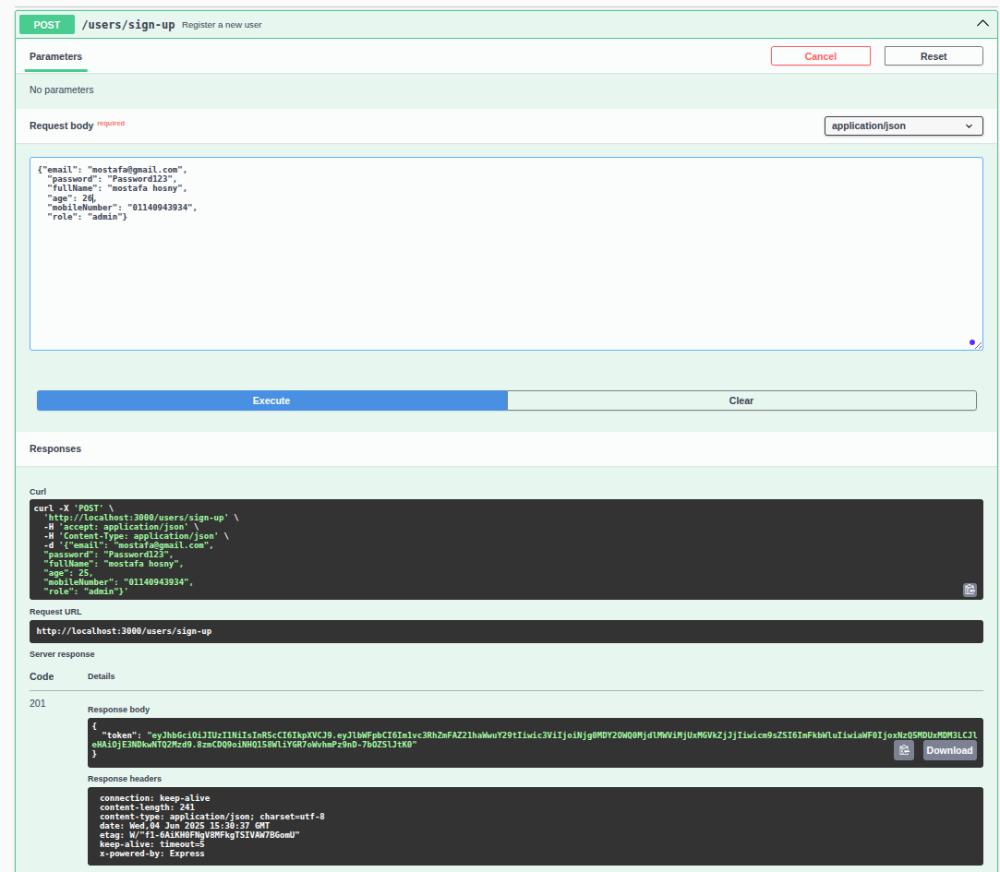
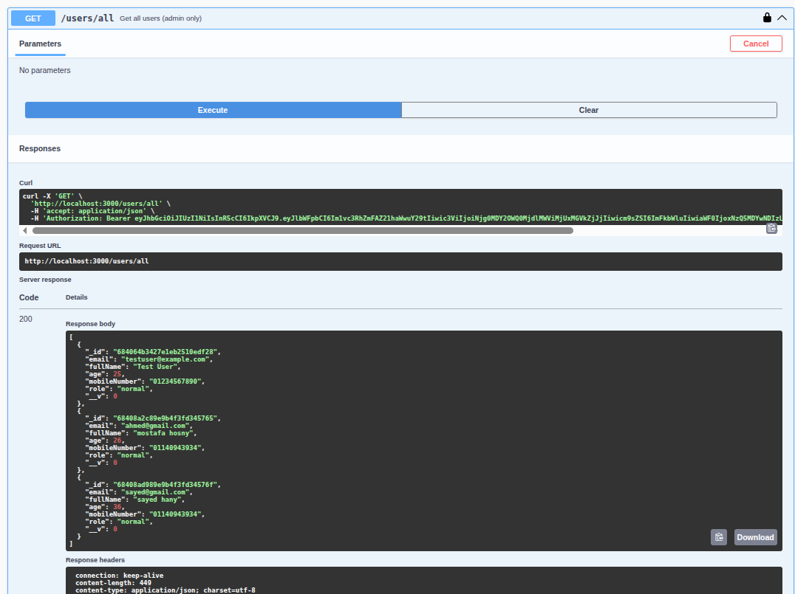

## User Endpoints

## Create Normal User

## Login as Normal User

## Authorization (Normal User)

## Normal User Profile

## All Users (Unauthorized Access as Normal User)

## Create Admin User

## Login as Admin

## Authorization (Admin)

## Admin User Profile

## All Users (Authorized Access as Admin)

